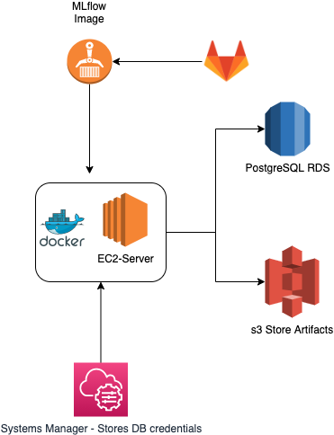

# mlflow-server

Please note: this infrastructure requires some environs to set (e.g. the location where to store the backend DB in S3 or the URL of the tracking server).
Before running it it is necessary to solve all the required environs with TBD as value
## Current Infrastructure

[MLflow server](TBD)

- Docker container that launches MLflow with Nginx as server proxy
- Internal Backend with SQlite as DB
- Cronjob to sync Backend in [S3](TBD)
- External artifacts root in [S3](TBD)

## Desired Infrastructure


## How to set up
- launch Linux AMI instance type with relevant Security Groups to be accessible externally via HTTPS
- add IAM role to have access on AWS S3
- install git, and clone this repository
```
    sudo yum install git
    sudo git clone <this_repo_url>
```  
- prepare and launch docker
```
    ./prepare_docker.sh
    ./launch_docker.sh
```  
- set up a cron job
```
    sudo service crond start
    crontab -e
```  
- cronjob to include inside the crontab (please note: hardcoded S3_DATABASE_LOCATION since it's not working properly)
```
    SHELL=/bin/sh
    PATH=/usr/local/bin:/usr/bin:/usr/local/sbin:/usr/sbin:/home/ec2-user/.local/bin:/home/ec2-user/bin
    0 1 * * * aws s3 sync /home/ec2-user/data/ s3://flixtech-primus-dev-mlflow-runs/backend_database/
```
    

## Improvements
- add environs in cronjob and launch cronjob with docker seamlessly (optional if no external DB)
- External DB (e.g. Snowflake or RDS)
- SSM to store DB credentials
- you have to manually install git at every run with sudo yum install git, machine with git preinstalled
- docker mlflow serve image stored in a repository
- CI/CD Gitlab pipeline AWS - GitLab

## References
- [Deploy MLflow with docker compose](https://towardsdatascience.com/deploy-mlflow-with-docker-compose-8059f16b6039)
- [Set Up MLflow on AWS EC2 Using Docker, S3, and RDS](https://aws.plainenglish.io/set-up-mlflow-on-aws-ec2-using-docker-s3-and-rds-90d96798e555)
- [Deploying Go App with NGINX + Docker to Amazon EC2](https://medium.com/easyread/deploying-go-app-with-nginx-docker-to-aws-ec2-b33d458918fd)
- [Deploy to AWS using Docker compose](https://medium.com/@umairnadeem/deploy-to-aws-using-docker-compose-simple-210d71f43e67)